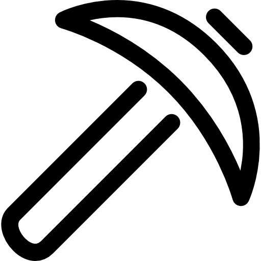
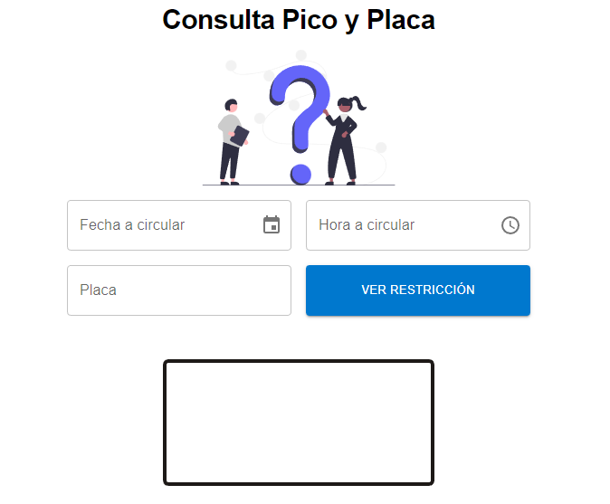
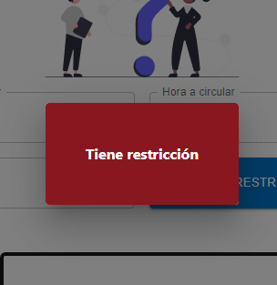
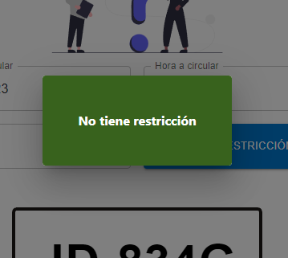

 

  

  <h3 align="center">Pico y Placa Predictor</h3>

  

    Pico y Placa predictor for Quito :3
     
    <a href="https://main--sprightly-cannoli-6efb02.netlify.app/">View Demo</a>
  

## About The Project

The entire app

If the plate has restriction

If the plate if free to go

The project is made to predict the traffic restrictions in Quito

Days based Restrictions:

| Dias      | Dígitos |
| --------- | ------- |
| Lunes     | 1 y 2   |
| Martes    | 3 y 4   |
| Miercoles | 5 y 6   |
| Jueves    | 7 y 8   |
| Viernes   | 9 y 0   |

### Built With

- 
- 
- 
- 

## Hope you like it ❤️
